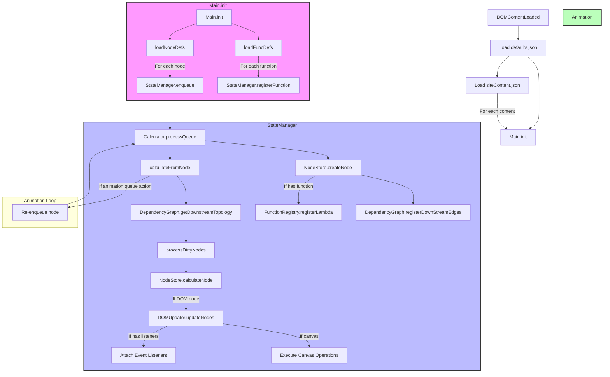

```mermaid
flowchart TD
    DOMContentLoaded --> LoadDefaults[Load defaults.json]
    LoadDefaults --> MainInit[Main.init]
    LoadDefaults --> LoadSiteContent[Load siteContent.json]
    LoadSiteContent --> |For each content| MainInit

    subgraph Main.init
        Init[Main.init] --> LoadFuncDefs[loadFuncDefs]
        Init --> LoadNodeDefs[loadNodeDefs]
        LoadFuncDefs --> |For each function| RegFunc[StateManager.registerFunction]
        LoadNodeDefs --> |For each node| EnqueueNode[StateManager.enqueue]
    end

    subgraph StateManager
        EnqueueNode --> Calculator[Calculator.processQueue]
        Calculator --> CreateNode[NodeStore.createNode]
        CreateNode --> RegisterEdges[DependencyGraph.registerDownStreamEdges]
        CreateNode --> |If has function| RegisterLambda[FunctionRegistry.registerLambda]
        Calculator --> CalculateFromNode[calculateFromNode]
        CalculateFromNode --> GetTopology[DependencyGraph.getDownstreamTopology]
        GetTopology --> ProcessDirty[processDirtyNodes]
        ProcessDirty --> CalcNode[NodeStore.calculateNode]
        CalcNode --> |If DOM node| DOMUpdate[DOMUpdator.updateNodes]
        DOMUpdate --> |If canvas| ExecuteCanvasOps[Execute Canvas Operations]
        DOMUpdate --> |If has listeners| AttachListeners[Attach Event Listeners]
    end

    subgraph Animation Loop
        CalculateFromNode --> |If animation queue action| ReEnqueue[Re-enqueue node]
        ReEnqueue --> Calculator
    end

    style Main.init fill:#f9f,stroke:#333,stroke-width:2px
    style StateManager fill:#bbf,stroke:#333,stroke-width:2px
    style Animation fill:#bfb,stroke:#333,stroke-width:2px
```
